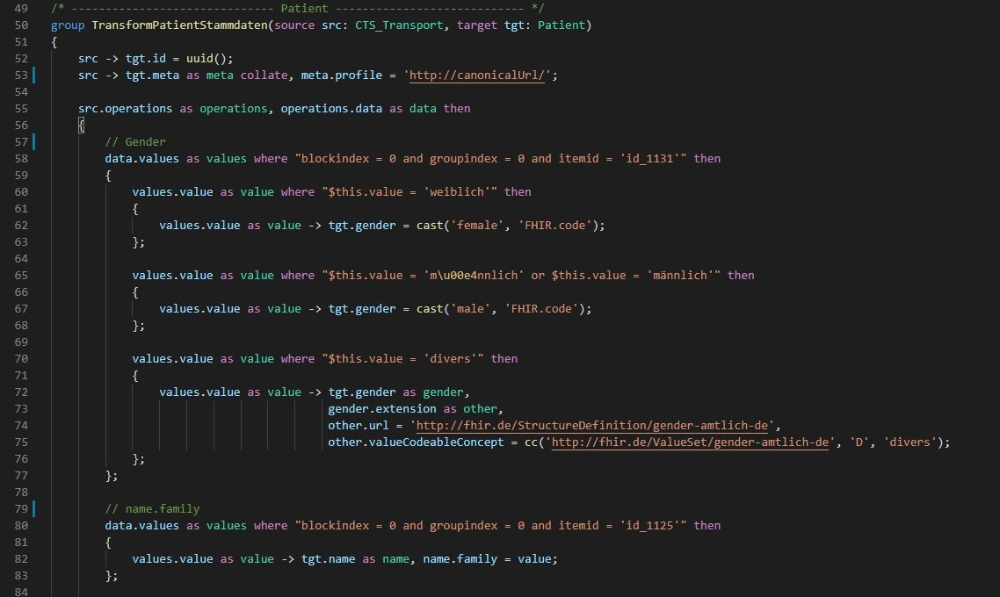

# FHIR Mapping Language syntax highlighter

This extension provides syntax highlighting for the FHIR Mapping Language and is published and maintained by [Healex](https://healex.systems/en/home/). We are a German company building FHIR based solutions in healthcare.

## Features
This extension adds full syntax highlighting support for the FHIR Mapping Language: 

It is automatically enabled for .map files but can be activated manually for any file type.

Make sure to use one of VS Code's default themes for the best experience.

## Quick Start

1. Install this extension
2. Open a .map file
3. Done!

If syntax highlighting is not enabled automatically for your file, do the following: 

1. Select the language mode in the lower right corner of Visual Studio Code 

2. Search for 'FHIR Mapping Language' in the dropdown and select 'FHIR Mapping Language' 

## Known Issues

1. There are minor highlighting inconsistencies for multiline strings. Feel free to submit a pull request with a solution for this issue. 

## Release Notes

### 1.0.0

Initial release of the FHIR Mapping Language syntax highlighter.